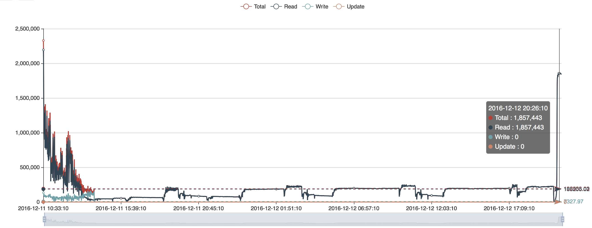
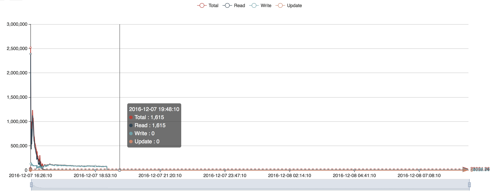
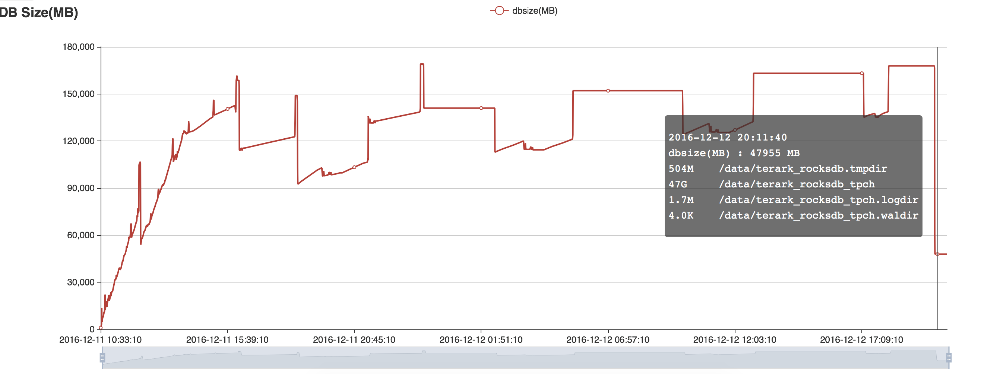
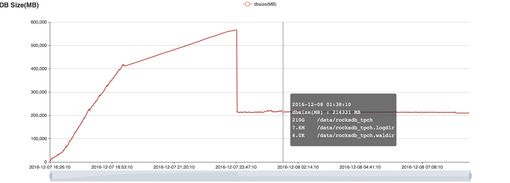
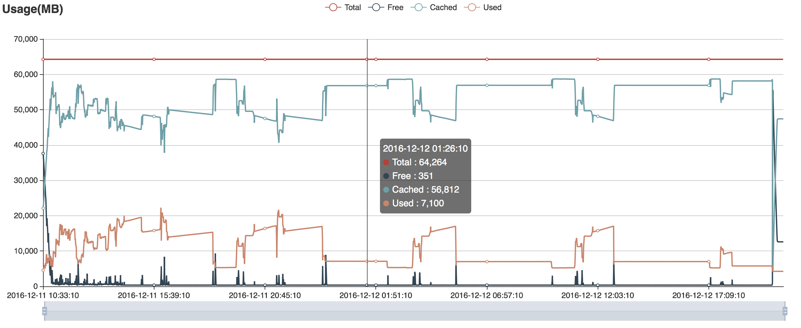
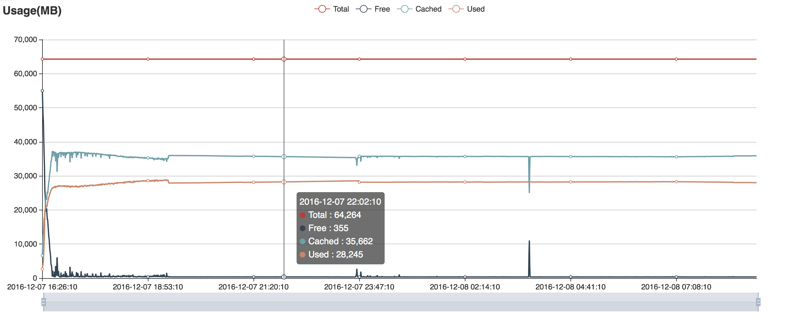
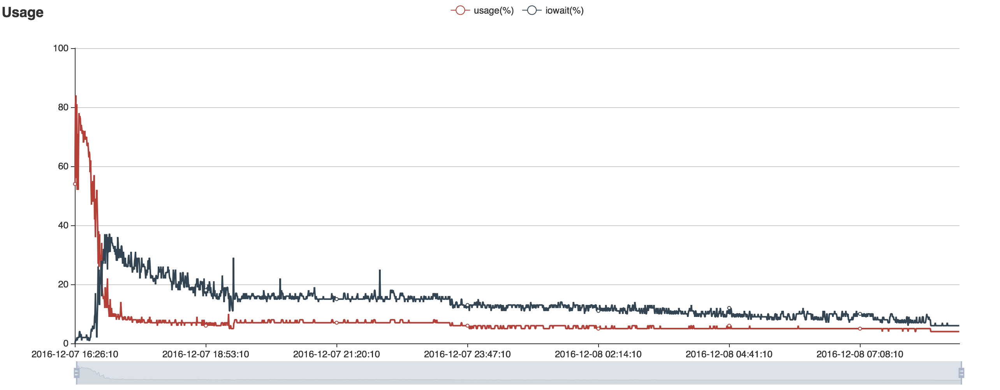

# TerarkDB vs. RocksDB 案例一

## 1. 测试数据集

我们在 TPC-H 数据集中使用 lineitem 表，并将 dbgen lineitem 中的 comment 文本字段的长度设置为 512（默认是 27 字节）。 因此，lineitem 表的平均行尺寸为 615 字节，其中，key 是前三个整数字段直接拼接而成的字符串。

数据集的总大小为 `554,539,419,806 bytes`，`897,617,396 rows`。 key 的总尺寸是 `22,726,405,004 bytes`, 剩余的是 value 总尺寸。

TPC-H dbgen 生成最原始的字符串数据，我们直接在测试中使用这些数据而不对数据进行任何转换。

## 2. 硬件
|                                                                    | 服务器配置                                  |
|--------------------------------------------------------------------|-------------------------------------------|
| CPU Number                                                         | 2                                         |
| CPU Type                                                           | Xeon E5-2680 v3                           |
| CPU Freq.                                                          | 2.5 GHz                                   |
| CPU Actual Freq.                                                   | 2.5 GHz                                   |
| Cores per CPU                                                      | 8 cores with 16 threads                   |
| Cores in total                                                     | 16 cores 32 threads                       |
| CPU Cache                                                          | 30M                                       |
| [CPU bogomips](http://www.cnblogs.com/youngerchina/p/5624439.html) | 4988                                      |
| Memory                                                             | 64GB                                      |
| Memory Freq.                                                       | DDR4 2133Hz                               |
| SSD Capacity                                                       | 2TB x 1                                   |
| SSD IOPS                                                           | 20000  (网络 SSD, 不是本地 SSD) |

## 3. DB 参数

|                                      | RocksDB                                                                                                                                                                                                                  | TerarkDB                              |
|--------------------------------------|--------------------------------------------------------------------------------------------------------------------------------------------------------------------------------------------------------------------------|---------------------------------------|
| Level Layers                         | 4                                                                                                                                                                                                                        | 4                                     |
| Compression                          | Level 0 doesn’t compress Level 1~3 use Snappy                                                                                                                                                                        | All level uses Terark Compression |
| Compact Type                         | Level based compaction                                                                                                                                                                                                   | Universal compaction                  |
| MemTable Size                        | 1G                                                                                                                                                                                                                       | 1G                                    |
| Cache Size                           | 16G                                                                                                                                                                                                                      | Do not need                           |
| MemTable Number                      | 3                                                                                                                                                                                                                        | 3                                     |
| Write Ahead Log                      | Disabled                                                                                                                                                                                                                 | Disabled                              |
| Compact Threads                      | 2~4                                                                                                                                                                                                                      | 2~4                                   |
| Flush Threads  (MemTable Compression) | 2                                                                                                                                                                                                                        | 2                                     |
| Terark Compress threads              | NA                                                                                                                                                                                                                       | 12                                    |
| Working Threads                      | 25 in total  24 Random Read, 1 Write                                                                                                                                                                                     | 25 in total  24 Random Read, 1 Write                       |
| Target_file_size_base                | Default (64M)                                                                                                                                                                                                            | 1G                                    |
| Target_file_size_multiplier          | 1 (SST size in RocksDB  do not influence performance)                                                                                                                                                                     | 5                                     |

对于两种引擎，我们禁用了所有的写限速:

- options.level0_slowdown_writes_trigger = 1000;
- options.level0_stop_writes_trigger = 1000;
- options.soft_pending_compaction_bytes_limit = 2ull<<40
- options.hard_pending_compaction_bytes_limit = 4ull<<40

## 4. 测试结果
### 4.1. OPS Comparison
#### 4.1.1. TerarkDB OPS

#### 3.1.2. RocksDB OPS

### 4.2. DB Size Comparison
#### 4.2.1. TerarkDB DB Size

#### 4.2.2. RocksDB DB Size

### 4.3. Memory Usage Comparison
#### 4.3.1. TerarkDB Memory Usage

#### 4.3.2. RocksDB Memory Usage

### 4.4. CPU Usage Comparison
#### 4.4.1. TerarkDB CPU Usage

#### 4.4.2. RocksDB CPU Usage

## 5. 测试结果说明

<table>
<tr>
  <td width="20%">&nbsp;</td>
  <td width="40%">RocksDB (DB Cache 16GB)</td>
  <td width="40%">TerarkDB</td>
</tr>
<tr>
  <td>0~2 minutes</td>
  <td>Read OPS 1M  写 OPS 140K  (Memory is enough)</td>
  <td>Read OPS 1.69M  写 OPS 120K  (Memory is enough)</td>
</tr>

<tr>
<td>2~15 minutes</td>
<td>Read OPS 690K  写 OPS 90K  (开始压缩,  内存压力增大,   但仍然足够使用)</td>
<td>Read OPS 850K   写 OPS 80K  (内存充足)</td>
</tr>

<tr>
  <td>15~30 minutes</td>
  <td> 读 OPS 下降到 10K  写 OPS 90K  (内存用尽)
</td>
  <td>读 OPS 在 500K~1M 间抖动,  写 OPS 60K.  
      CPU 利用率接近 100%, IOWait 接近 0.  
      (内存足够, 但是后台压缩线程和读线程开始竞争)</td>
</tr>

<tr>
<td>30~60 minutes</td>
<td>读 OPS 持续下降.  写 OPS 110K</td>
<td>读 OPS 在 350K ~ 980K 间抖动, 平均 500K. CPU 利用率开始下降. (压缩线程开始影响读线程)</td>
</tr>

<tr>
<td>60~120 minutes</td>
<td>读 OPS 持续下降.</td>
<td>读 OPS 剧烈波动, 平均 450K.
写 OPS 55K.</td>
</tr>

<tr>
<td>170 minutes</td>
<td>550G 数据全部写入, 平均写入 OPS 88K. SSD 利用率开始下降.</td>
<td>&nbsp;</td>
</tr>

<tr>
<td>173 minutes</td>
<td>读 OPS 降到 10K 以下</td>
<td>&nbsp;</td>
</tr>

<tr>
<td>3 hours 30 minutes</td>
<td>&nbsp;</td>
<td>550G 全部写完 (后台压缩线程明显影响读线程.)</td>
</tr>

<tr>
<td>3.5~11 hours</td>
<td>读 OPS 下降到 5000 以下</td>
<td>读 OPS 保持在 50K 左右 (数据逐渐被压缩，更多数据被装入内存)</td>
</tr>

<tr>
<td>8 hours 40 minutes</td>
<td>完整压缩完成, 数据尺寸 213GB</td>
<td>读 OPS 上升到 60K</td>
</tr>

<tr>
<td>11 hours</td>
<td>读 OPS 保持在 3K (数据无法完全装入内存)</td>
<td>读 OPS 上涨到 180K</td>
</tr>

<tr>
<td>>30 hours</td>
<td>&nbsp;</td>
<td>Data 压缩完成, 读 OPS 稳定在 1.85M (压缩完成后数据是 47GB, 可以全部装入内存)</td>
</tr>

</table>
