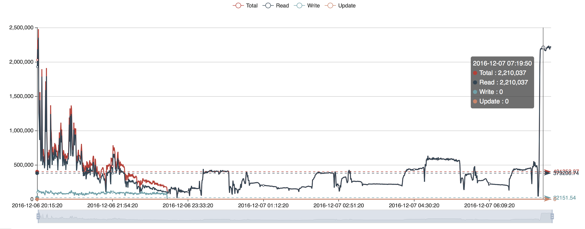
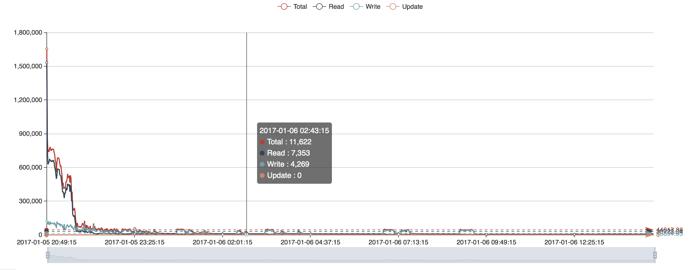
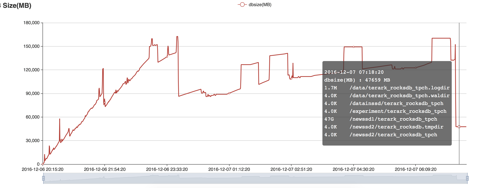
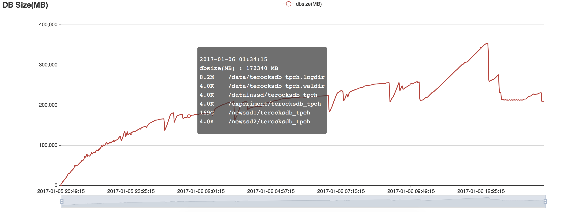
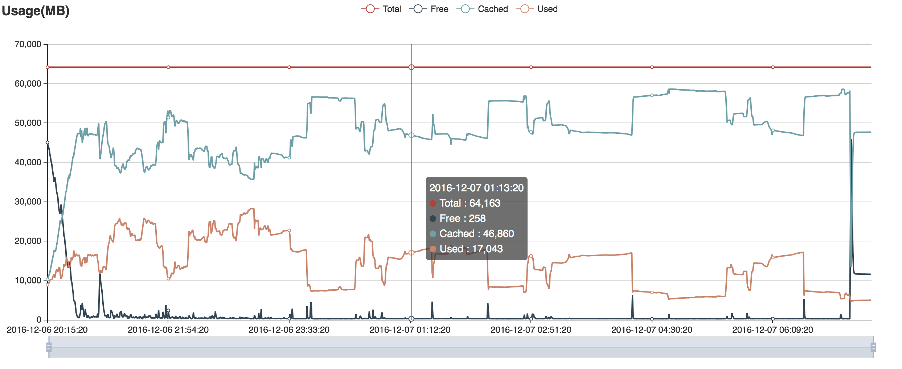
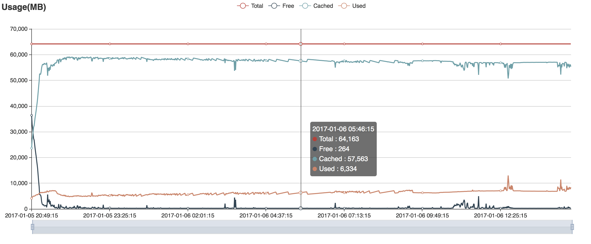
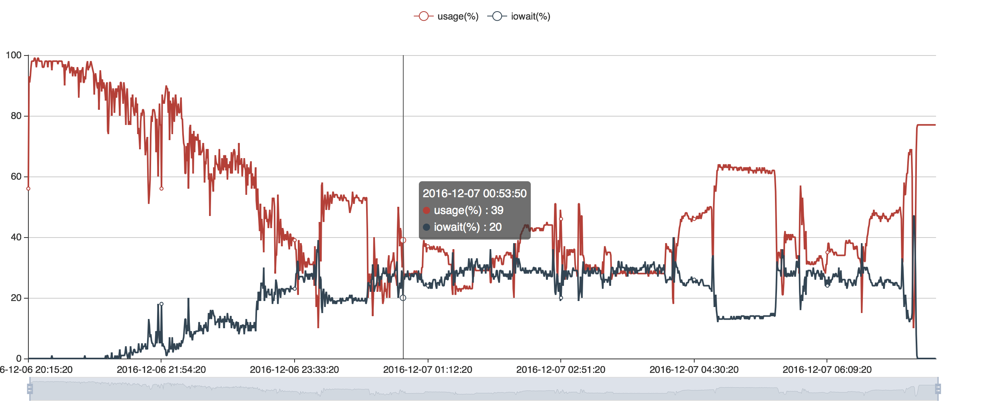
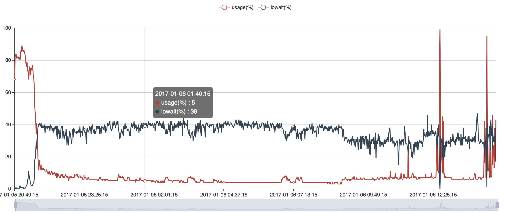

# TerarkDB vs. RocksDB 服务器二

## 1. 测试数据集

我们在 TPC-H 数据集中使用 lineitem 表，并将 dbgen lineitem 中的 comment 文本字段的长度设置为 512（默认是 27 字节）。 因此，lineitem 表的平均行尺寸为 615 字节，其中，key 是前三个整数字段直接拼接而成的字符串。

数据集的总大小为 554,539,419,806 bytes，897,617,396 rows。 key 的总尺寸是 22,726,405,004 bytes, 剩余的是 value 总尺寸。

TPC-H dbgen 生成最原始的字符串数据，我们直接在测试中使用这些数据而不对数据进行任何转换。

## 2. 硬件
|                                                                    | 服务器配置                                         |
|--------------------------------------------------------------------|--------------------------------------------------|
| CPU Number                                                         | 2                                                |
| CPU Type                                                           | Xeon E5-2630 v3                                  |
| CPU Freq.                                                          | 2.4 GHz                                          |
| CPU Actual Freq.                                                   | 2.6 GHz                                          |
| Cores per CPU                                                      | 8 cores with16 threads                           |
| Cores in total                                                     | 16 cores with 32 threads                         |
| CPU Cache                                                          | 20M                                              |
| [CPU bogomips](http://www.cnblogs.com/youngerchina/p/5624439.html) | 4793                                             |
| Memory                                                             | 64GB                                             |
| Memory Freq.                                                       | DDR4 1866Hz                                      |
| SSD Capacity                                                       | 480GB x 4                                        |
| SSD IOPS                                                           | 两个 Intel 730 IOPS 89000  两个 Intel 530 IOPS 41000 |

## 3. DB 参数

|                                      | RocksDB                                                                                                                                                                                                                  | TerarkDB                              |
|--------------------------------------|--------------------------------------------------------------------------------------------------------------------------------------------------------------------------------------------------------------------------|---------------------------------------|
| Level Layers                         | 4                                                                                                                                                                                                                        | 4                                     |
| Compression                          | Level 0 doesn’t compress Level 1~3 use Snappy                                                                                                                                                                        | All level uses Terark Compression |
| Compact Type                         | Level based compaction                                                                                                                                                                                                   | Universal compaction                  |
| MemTable Size                        | 1G                                                                                                                                                                                                                       | 1G                                    |
| Cache Size                           | 16G                                                                                                                                                                                                                      | Do not need                           |
| MemTable Number                      | 3                                                                                                                                                                                                                        | 3                                     |
| Write Ahead Log                      | Disabled                                                                                                                                                                                                                 | Disabled                              |
| Compact Threads                      | 2~4                                                                                                                                                                                                                      | 2~4                                   |
| Flush Threads  (MemTable Compression) | 2                                                                                                                                                                                                                        | 2                                     |
| Terark Compress threads              | NA                                                                                                                                                                                                                       | 12                                    |
| Working Threads                      | 25 in total  24 Random Read, 1 Write                                                                                                                                                                                     | 25 in total  24 Random Read, 1 Write                       |
| Target_file_size_base                | Default (64M)                                                                                                                                                                                                            | 1G                                    |
| Target_file_size_multiplier          | 1 (SST size in RocksDB  do not influence performance)                                                                                                                                                                     | 5                                     |

对于两个引擎，均禁用写入限速:

- options.level0_slowdown_writes_trigger = 1000;
- options.level0_stop_writes_trigger = 1000;
- options.soft_pending_compaction_bytes_limit = 2ull<<40
- options.hard_pending_compaction_bytes_limit = 4ull<<40

## 4. 测试结果
### 4.1. OPS Comparison
#### 4.1.1. TerarkDB OPS

#### 3.1.2. RocksDB OPS

### 4.2. DB Size Comparison
#### 4.2.1. TerarkDB DB Size

#### 4.2.2. RocksDB DB Size

### 4.3. Memory Usage Comparison
#### 4.3.1. TerarkDB Memory Usage

#### 4.3.2. RocksDB Memory Usage

### 4.4. CPU Usage Comparison
#### 4.4.1. TerarkDB CPU Usage

#### 4.4.2. RocksDB CPU Usage

## 5. 测试结果说明

<table>
<tr>
<td width="20%">&nbsp;</td>
<td width="40%">RocksDB (DB Cache 16GB)</td>
<td width="40%">TerarkDB</td>
</tr>

<tr>
<td>0~2 minutes</td>
<td>Read OPS 970K   Write OPS 100K (Level Compaction)</td>
<td>Read OPS 1.92M   Write OPS 120K (内存充足)</td>
</tr>

<tr>
<td>2~15 minutes</td>
<td>Read OPS 620K   Write OPS 96K</td>
<td>Read OPS 850K   Write OPS 100K (内存充足)</td>
</tr>

<tr>
<td>15~30 minutes</td>
<td>Read OPS 480K  Write OPS 83K  (读写性能逐渐下降)</td>
<td>读性能显著下降到 680K 左右.  写性能 88K, CPU 利用率接近 100%, IOWait 接近 0 (内存充足，但是压缩线程开始影响读性能)</td>
</tr>

<tr>
<td>30~60 minutes</td>
<td>Read OPS 220K  Write OPS 61K</td>
<td>Read OPS 在 330K 附近波动, 写 OPS 82K, CPU 利用率开始下降 (压缩线程影响读性能)</td>
</tr>

<tr>
<td>60~120 minutes</td>
<td>Read 17K   Write 39K   (内存用尽, 读写性能遇到瓶颈)</td>
<td>Read OPS 在 310K 附近波动.  Write OPS 90K 左右.</td>
</tr>

<tr>
<td>3 hours 20 minutes</td>
<td>读写性能持续下降</td>
<td>550G 数据完成写入, Read OPS 在 60 ~ 120K 间波动(压缩线程影响读性能)</td>
</tr>

<tr>
<td>3~11 hours</td>
<td>读写性能持续下降</td>
<td>Read OPS 170K 左右  (数据逐渐被压缩, 内存可以装入更多的数据)</td>
</tr>

<tr>
<td>12 hours 40 minutes</td>
<td>数据完成写入, 数据库总尺寸 234GB  (后台持续压缩)</td>
<td>Read OPS 持续增长</td>
</tr>

<tr>
<td>18 hours</td>
<td>数据完全压缩到 209GB, Read OPS 5K 左右</td>
<td>&nbsp;</td>
</tr>

<tr>
<td>30 hours</td>
<td>&nbsp;</td>
<td>数据压缩完成, Read OPS 在 2.2M 左右  (完整压缩后 47G, 数据可以完全装入内存)</td>
</tr>

</table>
