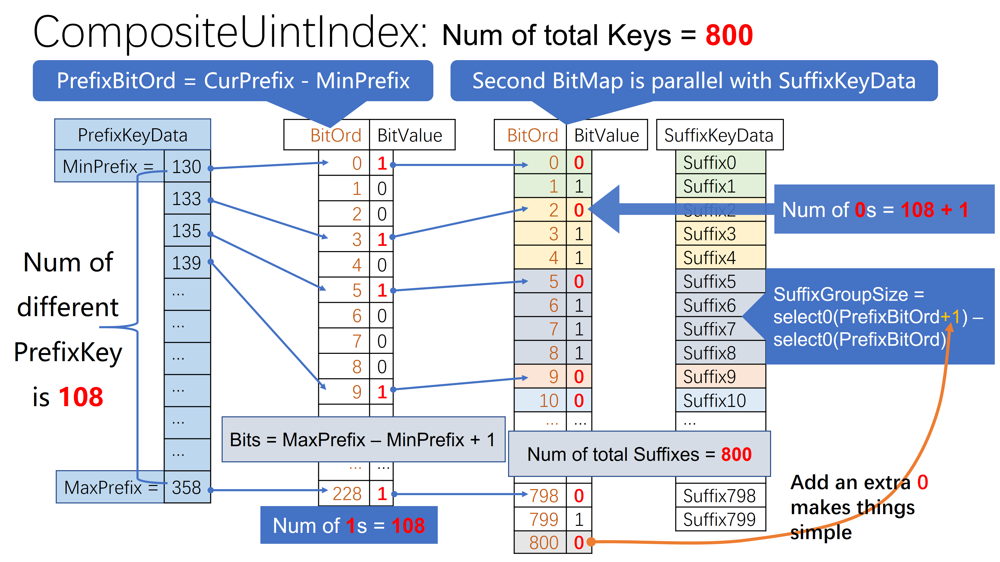

[[English|CompositeUintIndex English]]

在**特殊的** CO-Index 中，除了 [[UintIndex]]，还有 `CompositeUintIndex`：

## 仍以 MySQL 为例
还是 [[UintIndex]] 中的那个表：
```mysql
CREATE TABLE Student(
    id INT PRIMARY KEY AUTO_INCREMENT,
    name VARCHAR(255) INDEX,
    dorm_id INT INDEX,
    -- others ...
);
```
这次我们看 dorm_id（宿舍ID）上的 `Secondary Index`，对于 MyRocks，`Secondary Index` 对应到底层的 `KeyValue` 模型，`KeyValue`中
 `Key` 的逻辑结构为：
<span><table><tr><td>PrefixID</td><td>SecondaryKey</td><td>PrimaryKey</td></tr></table></span>
KeyValue 中的 `Value` 就直接为空。

我们可以通过配置 `keyPrefixLen` 将 `PrefixID` 消除，这样，`Key` 就只剩下<br/>`SecondaryKey + PrimaryKey`。

### 当索引是 unique 索引时
此时 `SecondaryKey` 和 `PrimaryKey` 是一对一的，这个索引可以看成是一个 `StaticSortedMap<SecondaryKey, PrimaryKey>`。这个优化实现就非常简单了: 
* 以 [[UintIndex]] 的方式对待 SecondaryKey
* 后面的 `PrimaryKey`，直接以数组的形式保存，我们只考虑 PrimaryKey 为定长的情况
  * PrimaryKey 为变长(例如String)时，占用空间可能会过多，此时将整个 `SecondaryKey + PrimaryKey` 使用 Nested Succinct Trie 表达会更合算
  * PrimaryKey 为变长(例如String)的情况比较罕见

### 当索引非唯一时
此时同一个 `SecondaryKey` 可能会对应多个 `PrimaryKey`，这个索引就可以看成是一个 `StaticSortedMap<SecondaryKey, Group<PrimaryKey> >` ，同样，我们只考虑 PrimaryKey 为定长的情况。

当习惯了 Rank-Select 思维方式时，很自然的，我们仍以 [[UintIndex]] 的方式对待 SecondaryKey，对后面的 `Group<PrimaryKey>`，则使用 `Rank-Select + 数组` 的形式保存：
* 把所有的 PrimaryKey 平铺开来，放到一个巨大的数组
* 在 Rank-Select 的 BitMap 中，为每个 `Group<PrimaryKey>` 添加起始标识和长度
  * 每个 Group 以 0 开始，Group 中有多少个 PrimaryKey，就再紧接着添加多少个 1
  * 在所有 Group 都结束后，末尾添加一个额外的 0（用于简化代码）
  * 我们已知，只要某个 SecondaryKey 存在，其对应的 `Group<PrimaryKey>` 的长度就至少为 1，所以我们可以省去一个 bit
    * 也就是说，起始 0 后面 1 的个数，等于 `Group.size - 1`
    * 从而，每个 Group 对应的总的 bit 个数就等于 `Group.size`
    * 如果该 BitMap 所有的 bit 都是 0，那说明，这个 index 实际上是 unique 的

## 图示如下
图中共有 `800 个 Key`，其中有 `108` 个不同的 `PrefixKey`，`MinPrefix = 130`，`MaxPrefix = 358`：



## 结论
最终，我们得到了这样一个设计：
```c++
template<class RankSelect1, class RankSelect2>
class CompositeUintIndex {...};
```
`RankSelect1` 对应于 [[UintIndex]] 中的 RankSelect，RankSelect2 用来表达 `Group<PrimaryKey>`。同理，根据 0 和 1 的相对数量，RankSelect2 可以是：
* RankSelectBitMap
* RankSelectAllZero
* RankSelectFewOne
* RankSelectFewZero

在这个设计中，我们不用区分 Unique Index 和 Non Unique Index，当 RankSelect2 是 AllZero 时，它就是 Unique Index。恰好，MyRocks 的
 Index 结构中，也没有区分 Unique Index 和 Non Unique Index……
## 推广到 MongoDB
我们将 [[UintIndex]] 中 MongoDB 的 Index 简介 Copy 过来：

MongoDB 有两大类 Key Value 数据，RecordStore（即 Collection） 和 Index：

||Key|Value|
|-|-|-|
|RecordStore|RecordID uint64|Document|
|UniqueIndex|IndexKey|RecordID uint64|
|StandardIndex|IndexKey + RecordID uint64|*Empty*|

这样，MongoDB 的 `RecordStore` 可以使用 [[UintIndex]]，`UniqueIndex` 和 `StandardIndex` 则可以使用 `CompositeUintIndex`。

以最常用的 `_id` 索引为例，`_id` 是 `UniqueIndex`，通常是 `ObjectId` 类型：
<table><tbody align="center">
<tr><th colspan="12">ObjectId layout</th></tr>
<tr>
  <td>0</td><td>1</td><td>2</td><td>3</td><td>4</td><td>5</td>
  <td>6</td><td>7</td><td>8</td><td>9</td><td>10</td><td>11</td>
</tr>
<tr>
  <td colspan="4">time</td><td colspan="3">machine</td> <td colspan="2">pid</td><td colspan="3">inc</td>
</tr>
</tbody></table>

实际上，存储为 IndexKey 的时候，因为可以为任意类型，例如 `String`，或者 `Long`，而不光是`ObjectId`，所以最前面还有个一字节的 `type` 前缀，这样，`type+time` 部分就对应 `CompositeUintIndex` 的 `PrefixKey`，余下的就是 `Suffix`。

**彩蛋**：我们可以看到，`machine+pid` 在一个 MongoDB Server 进程中是永远不变的，所以，还可以进一步压缩……
