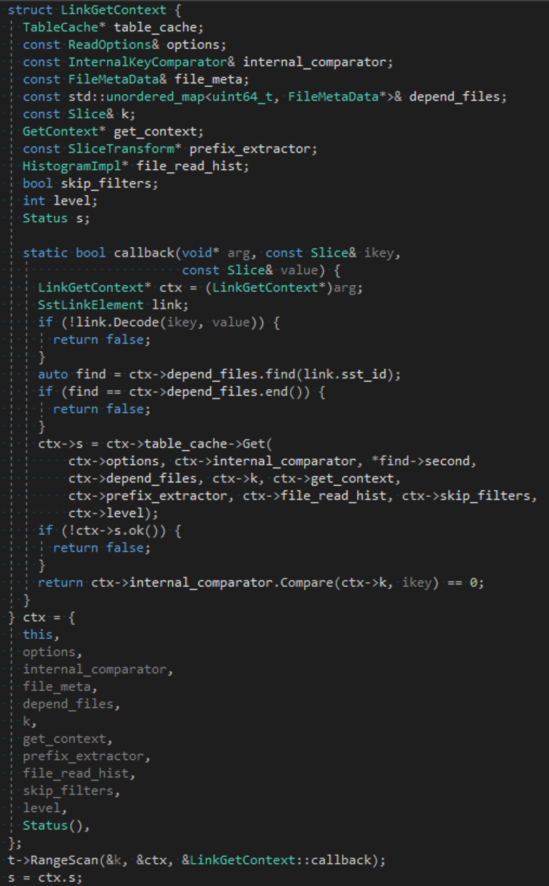
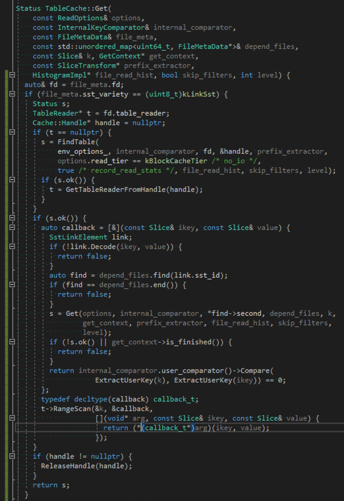

问题背景：我们最近正在对 RocksDB 进行一个非常重要的改进，誓要把 RocksDB 的写放大降到最低，同时还最小化读放大和空间放大。

为了追求极致的性能，在 RocksDB 中，需要回调 (`callback`) 的地方，RocksDB 的作者们没有使用 `std::function`，而是直接使用函数指针，但是，这就牺牲了开发人员宝贵的时间：相同功能的代码，变得很繁琐，同时还降低了代码可读性。

以前，我们的修改没有触碰到 callback 相关的这些代码，但是这次不同，我们有好几处修改都跟这些 callback 有关。作为重度强迫症患者，我们不能容忍这种丑陋的代码，我们必须找出一种美化方案……

最开始，只是想实现功能：

然后，我们意识到可以对 lambda 应用 `decltype` 操作，代码就变成了这样：


能不能更美观、更优雅呢？上面这种手工的 `decltype` 可以改进成这样：
```c++
template<class... Args, class Lambda>
auto gen_combinator(Lambda&) {
    return [](void* vlamb, Args... args) {
        return (*(const Lambda*)vlamb)(args...);
    };
}
//...
// usage:
table_reader->RangeScan(&k, &get_from_link,
    gen_combinator<const Slice&, const Slice&>(get_from_link));
```
细心的人可能已经看到，这里的 variadic template 不是最后一个模板参数，而我们能找到的 variadic template 示例，它都是最后一个模板参数……
其实，这样的用法，我也是第一次使用，使用时也曾有点疑虑，但是仔细一想，这又不是 C 语言的 printf，C++ 的变参列表是有完整类型信息的！

再者，`gen_combinator` 的这个实现，还需要 C++14 的支持，而 C++14 的支持，虽然各大编译器都没问题，但是架不住大家用的都是老版本的编译器呀。

那么，能否用 C++11 的语法实现 `gen_combinator` 呢？经过仔细思考，得出了这个结果：
```c++
template<class Lambda, class... Args>
auto combinator_imp(void* vlamb, Args... args)
-> decltype((*(Lambda*)vlamb)(args...)) {
     return (*(Lambda*)vlamb)(args...);
}
template<class... Args, class Lambda>
auto gen_combinator_cpp11(Lambda&)
->decltype(&combinator_imp<Lambda, Args...>) {
    return &combinator_imp<Lambda, Args...>;
}
```

好了，事情到此是否已经完结了吗？

要知道，强迫症是不能中途放弃治疗的，还有个多余的 `<const Slice&, const Slice&>` 在那里杵着扎眼呢！

理论上，Lambda 可以是个用户自定义的 struct/class，其中的 `operator()` 是可以重载的，Lambda 只能提供自身的类型信息，无法提供`如何调用`的信息。

`如何调用`，只要意识到这一点，问题的解决就有了方向：`Lambda` 对象的类型，为 `右值` 的类型提供了信息，我们把 `左值`的类型也用上，并且，我们把拗口的 `gen_combinator` 也改成了语义明确的 `c_style_callback`：
```c++
template<class Lambda>
struct c_style_callback_fetcher {
  template<class R, class... Args>
  static R callback(void* vlamb, Args... args) {
    return (*(Lambda*)vlamb)(std::forward<Args>(args)...);
  }
  template<class R, class... Args>
  operator decltype(&callback<R, Args...>)() const {
             return &callback<R, Args...>;
  }
};
template<class Lambda>
c_style_callback_fetcher<Lambda> c_style_callback(Lambda&) {
  return c_style_callback_fetcher<Lambda>();
}
```
在这段代码中，`左值`的类型就是那个函数指针，函数指针的类型，为 `Args` 的类型推导提供了信息。

然而，这段完全符合 C++11 语法的代码，在 Visual C++ 2017 中爆出诡异的编译错误：
```
error C2544: expected ')' for operator '()'
note: see reference to class template instantiation 'c_style_callback_fetcher<Lambda>' being compiled
error C2988: unrecognizable template declaration/definition
error C2143: syntax error: missing ';' before 'decltype'
error C2238: unexpected token(s) preceding ';'
error C2059: syntax error: ')'
error C2334: unexpected token(s) preceding '{'; skipping apparent function body
```
换 `gcc-4.8 -std=c++11`，一切 OK！

虽然是编译器的锅，但是我们得想办法 workaround：
```c++
template<class Lambda>
struct c_style_callback_fetcher {
  template<class R, class... Args>
  static R callback(void* vlamb, Args... args) {
    return (*(Lambda*)vlamb)(std::forward<Args>(args)...);
  }
  template<class R, class... Args>
  using callback_t = R (*)(void* vlamb, Args... args);
  template<class R, class... Args>
  operator callback_t<R, Args...>() const { return &callback<R, Args...>; }
};
template<class Lambda>
c_style_callback_fetcher<Lambda> c_style_callback(Lambda&) {
  return c_style_callback_fetcher<Lambda>();
}
```

最终，那行代码可以这样写：
```c++
table_reader->RangeScan(&k, &get_from_link, c_style_callback(get_from_link));
```
在 Visual C++ 2017 中，看生成的汇编代码，`c_style_callback_fetcher::callback` 只有一个跳转指令 `jmp XXXX`……

我们期待编译器可以将 `jmp` 的目标内联过去，进一步提高性能。

这里使用的 `operator` 技巧，可以参见：[怎样让C++函数重载时连返回值类型也加入重载决议?](http://nark.cc/p/?p=131)

全文完！
