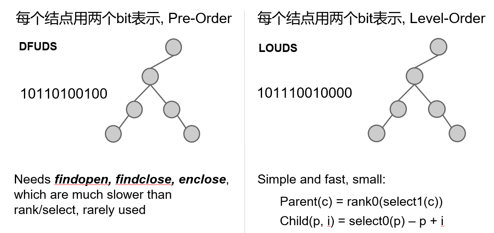
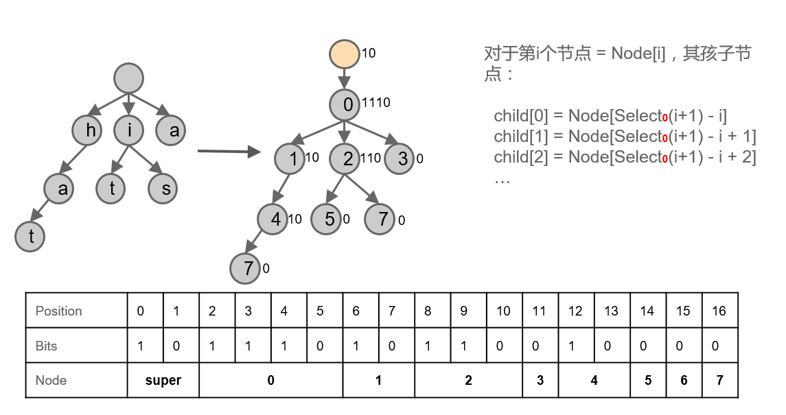
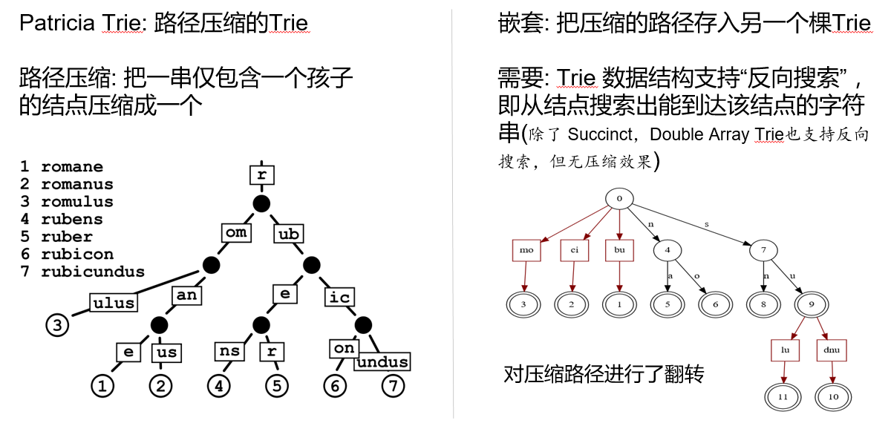

# TerarkDB 技术内幕
TerarkDB 实现了存储引擎的性能巅峰，这里面，倾注着我们不懈的努力……

## 背景知识：FM-Index
[FM-Index](https://en.wikipedia.org/wiki/FM-index) 的全名是 Full Text Matching Index，属于 [Succinct Data Structure](https://en.wikipedia.org/wiki/Succinct_data_structure) 家族，对数据有一定的压缩能力，并且可以直接在压缩的数据上执行搜索和访问。

FM-Index 的功能非常丰富，历史也已经相当悠久，不算是一种新技术，在一些特殊场景下也已经得到了广泛应用，但是因为各种原因，一直不温不火。最近几年，FM-Index开始有些活跃，首先是 github 上有个大牛实现了全套 Succinct 算法([sdsl-lite](https://github.com/simongog/sdsl-lite))，其中包括 FM-Index，其次 Berkeley 的 [Succinct 项目](http://succinct.cs.berkeley.edu/)也使用了 FM-Index 。

FM-Index 属于 Offline 算法（一次性压缩所有数据，压缩好之后不可修改），一般基于 BWT 变换（BWT 变换基于后缀数组），压缩好的 FM-Index 支持以下两个最主要的操作：
- data = extract(offset, length)
- {offset} = search(string) ，返回多个匹配 string 的位置/偏移(offset)

FM-Index 还支持更多其他操作，感兴趣的朋友可以进一步调研。

但是，在 Terark 看来，FM-Index有几个致命的缺点：
- 实现太复杂（这一点可以被少数的大牛们克服，不提也罢）
- 压缩率不高（比流式压缩例如gzip差太多）
- 搜索(search)和访问(extract)速度都很慢
  - 在2016年最快的CPU i7-6700K 上，单线程吞吐率不超过 7MB/sec
- 压缩过程又慢又耗内存（Berkeley Succinct 压缩过程内存消耗是源数据的 50 倍以上）
- 数据模型是 Flat Text，不是数据库的 KeyValue 模型

可以用一种简单的方式把 Flat Model 转化成 KeyValue Model：挑选一个在 key 和 value 中都不会出现的字符 `#`（如果无法找出这样的字符，需要进行转义编码），每个key前后都插入该字符，key 之后紧邻的就是 value。这样，search(`#key#`) 返回了 `#key#` 出现的位置，我们就能很容易地拿到 value 了。

Berkeley 的 [Succinct 项目](http://succinct.cs.berkeley.edu)在 FM-Index 的 Flat Text 模型上实现了更丰富的行列(Row-Column)模型，付出了巨大的努力，达到了一定的效果，但离实用还相差太远。

感兴趣的朋友可以仔细调研下 FM-Index，相信会有一些有趣的发现。

## Terark 的可检索压缩（Searchable Compression）
Terark 公司提出了“可检索压缩（Searchable Compression）”的概念，其核心也是直接在压缩的数据上执行搜索(search)和访问(extract)，但数据模型本身就是 KeyValue 模型，根据我们的测试，速度要比 FM-Index 快得多（两个数量级），具体来说：
- 摒弃传统数据库的块压缩技术，采用全局压缩
- 对 key 和 value 使用不同的全局压缩技术
- 对 key 使用有搜索功能的全局压缩技术 CO-Index（对应 FM-Index 的 search）
- 对 value 使用可定点访问的全局压缩技术 PA-Zip（对应 FM-Index 的 extract）

## 对 Key 的压缩：CO-Index

普通的索引技术，索引的尺寸相对于索引中原始 key 的尺寸大要大很多，有些索引使用前缀压缩，能在一定程度上缓解索引的膨胀，但仍然是治标不治本，无法解决索引占用内存过大的问题。
Terark 提出了 CO-Index (Compressed Ordered Index) 的概念，并且通过一种叫做 Nested Succinct Trie 的数据结构实践了这个概念。

Terark 使用了自己研发的一种叫做 Nested Succinct Trie 的索引技术有很多优点，只考虑 key 本身，不考虑 key 对应的 value，这个压缩率一般能达到 5 倍左右。对于一些特殊的 key，压缩率更高，比如对 url 的压缩率能达到 10 倍以上。相比传统实现索引的传统数据结构的膨胀，前两者的空间占用小相差十几倍甚至几十倍。并且，在保持这个压缩率的同时，还支持丰富的搜索功能：
- 精确搜索
- 范围搜索
- 顺序遍历
- 前缀搜索
- 正则表达式搜索（不是逐条遍历）
  - *RocksDB 的 API 不支持正则表达式搜索，所以这个功能需要通过 Terark 的专有 API 来调用*

与 FM-Index 相比，CO-Index 也有巨大的优势（假定 FM-Index 中所有的数据都是 Key）：

|||
|-----|-|
|功能|`CO-Index` 用来实现 `FM-Index` 概念中的 `search` 操作，这个 `search` 返回一个<br/>`内部 ID`，该 `内部 ID` 被用来访问相应的 value；**注1**|
|性能|`CO-Index` 的搜索速度一般情况下是 `FM-Index` 的 3 倍以上|
|压缩率|`CO-Index` 的压缩率一般情况下是 `FM-Index` 的 4 倍以上|

**注1**：对于 `CO-Index`，如果我们先有 ID，也可以用 ID 来 `extract` 相应的 key，我们称之为`反向搜索`，但是`反向搜索`这个功能目前在 KeyValue 数据库中暂时用不上。

### CO-Index 的原理
实际上 Terark 实现了很多种 CO-Index，其中 Nested Succinct Trie 是适用性最广的 一种 CO-Index，在这里对其原理做一个简单介绍：
#### Succinct Data Structure 介绍
Succinct Data Structure 是一种能够在接近于信息论下限的空间内来表达对象的技术，通常使用位图来表示，用位图上的 rank 和 select 来定位。

虽然能够极大的降低内存占用量，但是实现起来较为复杂，并且性能低很多（时间复杂度的常数项很大）。目前比较流行的是 [SDSL-Lite](https://github.com/simongog/sdsl-lite)，但是为了追求极致的性能，Terark [自己实现了 Rank-Select](http://github.com/Terark/terark-base)，性能对比: [terark vs SDSL-Lite](https://github.com/Terark/terark-wiki-zh_cn/blob/master/rankselect/rankselect.md)。

#### 以二叉树为例
传统的表现形式是一个结点中包含两个指针：
```c++
struct Node { Node *left, *right; };
```
每个结点占用 2ptr，如果我们对传统方法进行优化，结点指针用最小的 bits 数来表达，N 个结点就需要 <strong>2*⌈ log<sub>2</sub>⁡(N)⌉</strong> 个 bits。

- 对比传统基本版和传统优化版，假设共有 2<sup>16</sup> 个结点(包括null结点)
  - 传统优化版需要 2 bytes（整数作为指针：数组下标）
  - 传统基本版需要 4 或 8 bytes（一个指针宽度）
- 对比传统优化版和 Succinct，假设共有 10 亿(~2<sup>30</sup>)个结点
  - 传统优化版每个指针占用 ⌈log<sub>2</sub> (2<sup>30</sup>)⌉ = 30 bits，总内存占用：(<sup>(2*30)</sup>&frasl;<sub>8</sub>)*2<sup>30</sup> ≈ 7.5GB
  - 使用 Succinct，占用：（<sup>2.5</sup>&frasl;<sub>8</sub>）* 2<sup>30</sup> ≈ 312.5MB(每个结点 2.5 bits，其中 0.5 bits 是 rank-select 索引占用的空间）

#### Succinct Tree
Succinct Tree 有很多种表达方式，这里列出常见的两种：

 

**Succinct Trie = Succinct Tree + Trie Label**

Trie 可以用来实现 Index，下面这个 Succinct Trie 用的是 LOUDS 表达方式，其中保存了 hat,is,it,a 四个 Key。

 
 
#### Patricia Trie 加 嵌套
仅使用 Succinct 技术，压缩率远远不够，所以又应用了路径压缩和嵌套。这样一来，压缩率就上了一个新的台阶。

 

把上面这些技术综合到一起，就是 Terark 的 `Nest Succinct Trie`。

### 其它 CO-Index
除了 Nested Succinct Trie，TerarkDB 还实现了其它一些 CO-Index:

|||
|--|--|
|[UintIndex](UintIndex.md)Full|Key 是完整的整数范围，中间没有空洞|
|UintIndexFewHole|Key 是**非常密集**的整数范围，范围中只**缺失极少**的整数|
|UintIndexBitMap |Key 是**比较密集**的整数范围，范围中有**缺失部分**的整数|
|[CompositeUintIndex](CompositeUintIndex.md)AllZero|...|
|CompositeUintIndexBitMap|...|
|CompositeUintIndexFewOne|...|

这些 Index 的详细内容，我们会逐步介绍。

## 对 value 的压缩: PA-Zip
Terark 研发了一种叫做 `PA-Zip (Point Accessible Zip)` 的压缩技术：每条数据关联一个 ID，数据压缩好之后，就可以用相应的 ID 访问那条数据。这里，ID 就是那个 Point，所以叫做 Point Accessible Zip。

`PA-Zip` 对整个数据库中的所有 Value （KeyValue 数据库中所有 Value 的集合）进行全局压缩，而不是按 block/page 进行压缩。

这这种压缩是 Terark 专门针对数据库的需求（KeyValue 模型），专门精心设计的一个压缩算法，用来彻底解决传统数据库压缩的问题：

该算法综合使用了很多种技术，非常复杂，并且涉及到 Terark 的一些专利和保密算法，所以这里略过技术细节，只描述该算法的性能特点：

压缩率更高，没有双缓存的问题，只要把压缩后的数据装进内存，不需要专用缓存，可以按 RowID/RecordID 直接读取单条数据，如果把这种读取单条数据看作是一种解压，那么——
- 按 RowID 顺序解压时，解压速度（Throughput）一般在 500MB/sec (单线程)，最高达到约 7GB/s，可以用于适合离线分析性场景需求，传统数据库压缩也能做到这一点
- 按 RowID 随机解压时，解压速度一般在 300MB每秒(单线程)，最高达到约 3GB/s，适合在线服务需求，这一点完胜传统数据库压缩：按随机解压 300MB/s 算，如果每条记录平均长度 1K，相当于 QPS = 30万，如果每条记录平均长度300个字节，相当于QPS = 100万！
- 预热(warmup)，在某些特殊场景下，数据库可能需要预热。因为去掉了专用缓存，Terark存储引擎，TerarkDB 的预热非常简单却又极其高效，只要把 mmap 的内存预热一下（避免 Page Fault 即可）设置 mmapPopulate，数据库加载成功后就是预热好的，这个预热的 Throughput 就是 SSDssd 连续读的 IO 性能(较新的 SSDssd 读性能是超过以 5GB/s计的)
- NVDIMM 适用性，一般情况下，PA-Zip 中的大部分数据（90%以上）可以放入 NVDIMM 并直接访问，这样，在获得更高性能的同时，还会进一步降低成本。<table><tr><td>
<ul>
<li>NVDIMM 是 Non-Volatile DIMM，即数据持久化的内存，可以当 RAM 用，操作系统对 NVDIMM 的访问会绕过Page Cache。</li>
<li>Intel Optane（傲腾）就有这样的产品，其价格大约是 RAM 的 30%，但是访问速度（特别是 latency）要慢一些。如果是全随机访问，性能会比 RAM 低很多，但如果是顺序访问（例如顺序访问100个字节），性能就基本可以和相应的计算（例如在这100个字节上运行PA-Zip解压算法）匹配了。随着技术的成熟和市场的扩大，其价格应该还会进一步降低，性能也会进一步提高。
</li>
</code></td></tr></table>

与 FM-Index 相比，PA-Zip 解决的是 FM-Index 的 extract 操作，但性能和压缩率都要好的多：

|||
|---------|-|
|**功能**|对应 FM-Index 的 extract 操作|
|**性能**|比 FM-Index 的 extract 快 100 倍以上|
|**压缩率**|比 FM-Index 的压缩率高 3 倍以上|
	
## 结合 Key 与 Value
Key 以全局压缩的形式保存在 IndexCO-Index 中，Value 以全局压缩的形式保存在 PA-Zip中。搜索一个 kKey，会得到一个内部 ID，根据这个内部 ID，去全局压缩的 Value 集合 PA-Zip 中定点访问该 ID 对应的 Value，整个过程中只触碰访问需要的数据，不需要触碰其它数据。

这样，不需要专用的缓存(例如 RocksDB 中的 DB Cache)，仅使用 mmap，完美配合文件系统缓存，整个 DB 只有 mmap 的文件系统缓存这一层缓存，再加上超高的压缩率，大幅降低了内存用量，并且大幅简化了系统的复杂性，最终大幅提高了数据库的性能。

将来如果使用 Optane DIMM，也就是使用内存插槽的傲腾，对 PA-Zip 的数据访问，就可以不使用 RAM，我们可以预期，到时候 CPU 以访问 RAM 的形式直接访问 Optane DIMM，只是 Latency 比 RAM 高一些，这样，节省出来的 RAM 可以用于 CO-Index，从而进一步提高数据库的容量。（这里批评一下 intel，现在叫做傲腾内存的产品，实际上是 M.2 接口的傲腾，而不是“内存”形式的傲腾）

可以看到，Terark 存储引擎完全摒弃了没有使用通过自主创新传统数据库的块压缩，另辟蹊径，同时实现了超高的压缩率和超高的随机读性能。
从更高的哲学层面看，Terark 存储引擎很像是用构造法推导出来的，因为 CO-Index 和 PA-Zip 紧密配合，完美匹配 KeyValue 模型，功能上“刚好够用”，性能上压榨硬件的极限，压缩率逼近信息论的极限。相比其它方案：
<table><tr><td>
<ul>
<li>
  传统块压缩是从通用的流式压缩衍生而来的，流式压缩的功能非常有限，只有压缩和解压两个操作，对太小的数据块还没有压缩效果，也无法压缩数据块之间的冗余。把它用到数据库上，需要大量的工程努力，就像给汽车装上翅膀，然后想尽办法让它飞起来
</li>
<li>
相比 FM-Index，情况又反了过来，FM-Index 的功能非常丰富，它就必然要付出一些代价，这些代价就是压缩率和性能。而在 KeyValue 模型中，我们只需要它那些丰富功能的一个非常小的子集（还要经过适配和转化），其它更多的功能毫无用武之地，却仍然要付出那些代价，就像我们花了很高的代价造了一架飞机，却把它按在地上，只用轮子跑，当汽车用
</li>
</ul>
</td></tr></table>
