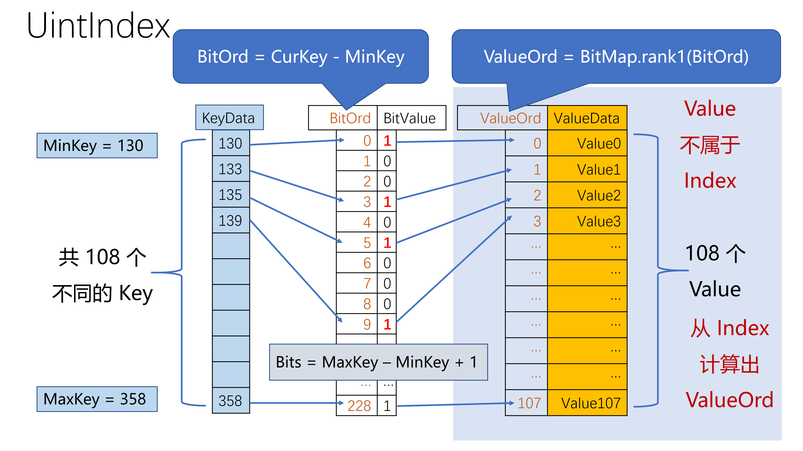

在 TerarkDB 的 CO-Index(Compressed Ordered Index) 家族中，Nest Succinct Trie 是**最通用**的。但是，伴随**通用**的，往往是**低效**。我们针对一些特殊场景，采用了特殊的实现，用以提高性能……

这里面，最特殊的一类 Index，就是 UintIndex，顾名思义，就是 Key 为 unsigned int 时的 index。

## 以 MySQL 为例
在 MySQL 中，我们往往会建立这样一个表：
```mysql
CREATE TABLE Student(
    id INT PRIMARY KEY AUTO_INCREMENT,
    name VARCHAR(255) INDEX,
    dorm_id INT INDEX,
    -- others ...
);
```

这里的 `PRIMARY KEY` 最终体现到 MyRocks，是这样的形式：
<table><tr><td>PrefixID</td><td>id</td></tr></table>

通过配置，我们可以通过 `keyPrefixLen` 将 `PrefixID` 分离出去，这样，Index 中就只剩下一个 `id` 字段了，并且，在 SST 中，这些 `id` 往往都是比较紧密的范围（被删除的 `id` 是范围中的`空洞`），比如，在某个 SST 中，存储的 id 范围是 1,000,000~2,000,000。

并且，我们知道，CO-Index 会将用户 Key(在这里就是 id 字段) 映射到一个 `内部ID`，再用这个 `内部ID` 去访问 PA-Zip……

在一个 SST 中，把这一切串起来，我们就能使用简单且高效的方式来实现 Index 了：



图中的 `ValueOrd` 就是前面说的 `内部ID`，Index 共有 108 个 Key，BitMap 中有 `MaxKey - MinKey + 1 = 229` 个 Bit。

* 如果这个范围中，一个`空洞`也没有，那么，Index 中我们只需要保存 `id` 的最大最小值。
  - 内部ID = Student.id - MinStudentID
* 如果这个范围中，只有极少数的`空洞`，那么，Index 中我们只需要保存那些`空洞` 中的 `id`。
  - 内部ID = Student.id - (Hole num before this Student.id)
* 如果这个范围中，有相当数量的`空洞`，那么，Index 中我们只需要保存一个 BitMap，其中相应 bit 的含义是`这个 id 是否存在`。
  - 利用 Rank-Select 的思想：内部ID = BitMap.rank1(id)

进一步，在概念上，如果我们把 **一个空洞也没有** 和 **只有极少数的空洞** 也用 Rank-Select 来表达：

|||
|----|--|
|RankSelectAllOne|等效于 BitMap 中所有 bit 都为 1，但并不需要保存这些 bit|
|RankSelectFewZero|等效于 BitMap 极少数 bit 位 0，比如说只有 1% 的 bit 为 0<br/>只需要将这些为 0 的 bit 的位置保存为整数数组|

那么，这三种情况，在形式上就可以统一起来！实际上，在代码实现中，这三种不同的 Rank-Select 实现是作为模板类 UintIndex 的模板参数的，在保持抽象的同时，又不损失性能。

## 应用到 MongoDB
在 MongoDB 中，也存在类似 MySQL Student.id 这样的东西：

MongoDB 有两大类 Key Value 数据，RecordStore（即 Collection） 和 Index：

||Key|Value|
|-|-|-|
|RecordStore|RecordID uint64|Document|
|UniqueIndex|IndexKey|RecordID uint64|
|StandardIndex|IndexKey + RecordID uint64|*Empty*|

这样，MongoDB 的 RecordStore 也可以利用 UintIndex

## 压缩率 & 性能
压缩率自然不用说，UintIndexAllOne 的压缩率接近于无穷大，压缩率最差的 UintIndexBitMap，其压缩率也在 30 倍以上！

性能，最关键的是性能，相比传统的块压缩，Nest Succinct Trie 最大的性能劣势在于顺序扫描（从头至尾顺序扫描，定位到某个点然后接着顺序扫描），因为对于 Nest Succinct Trie，即便是顺序扫描，它的计算也很复杂，并且内存访问非常随机。而对于 UintIndex，事情就简单多了，比 Nest Succinct Trie 会快 100 倍以上，而其中占比最大的性能开销，实际上是函数调用本身！

## 接下来
我们还有更复杂的索引：[CompositeUintIndex](CompositeUintIndex.html)...
